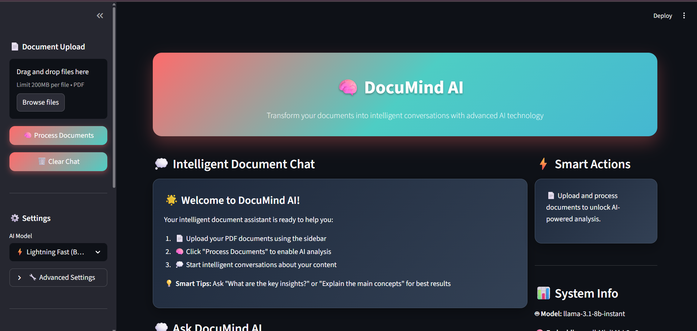

# 🧠 DocuMind AI - Smart Document Assistant
<p align="center">
  <a href="https://www.python.org/"></a>
  <a href="https://streamlit.io/"></a>
  <a href="https://www.langchain.com/"></a>
  <a href="https://groq.com/"></a>
  <a href="https://faiss.ai/"></a>
  <a href="https://huggingface.co/"></a>
  <a href="https://pytorch.org/"></a>
</p>

---

## 🌐 Live Demo & Deployment

- 🚀 **Try it here:** [DocuMind AI - Smart Document Assistant](https://docmind-ai-kp.streamlit.app)  
- 📽️ **Deployment Video:** [Watch](https://drive.google.com/file/d/1OTtTHaZRkavjen6Cm4BN_j4PXN7yrKL4/view?usp=sharing)  

<div align="center">
  
  <p><em>Main Interface</em></p>
</div>

---

## 📖 Project Overview

DocuMind AI is an **intelligent document analysis platform** that transforms your PDFs into **interactive, conversational experiences**.  
Upload documents and ask natural language questions to extract insights, analyze content, and explore knowledge in a human-like way.

---

## ✨ Key Features

### 🧠 AI-Powered Intelligence
- Smart Document Analysis with advanced AI algorithms  
- Contextual Understanding of relationships & themes  
- Actionable Insights and patterns  
- Natural Language Conversations with your files  

### 🎨 Modern Interface
- Clean & Professional Design  
- Intuitive Navigation  
- Responsive for desktop/mobile  
- Real-time Interaction & Feedback  

### 🚀 Advanced Capabilities
- Multi-Document Analysis  
- FAISS-Powered Semantic Search  
- Conversational Memory  
- Lightning-Fast AI with **Groq**  
- Source Attribution for transparency  
- Customizable AI Parameters  

---

## 🔧 Architecture

1. **Document Ingestion** → PDF parsing & text extraction  
2. **Text Chunking** → Recursive splitting for continuity  
3. **Vector Embeddings** → HuggingFace sentence-transformers  
4. **Vector Storage** → FAISS for efficient retrieval  
5. **Query Processing** → LangChain conversational chain  
6. **Response Generation** → Groq-powered contextual answers  

---

## ⚙️ Technology Stack

- **Frontend** → Streamlit  
- **Backend** → LangChain  
- **Vector DB** → FAISS  
- **Embeddings** → HuggingFace Transformers  
- **LLMs** → Groq API (Llama3, Mixtral, etc.)  
- **Language** → Python  

---

## 🚀 Quick Start

### Option 1: Automated Setup
```bash
# Windows
setup.bat

# Linux/Mac
./setup.sh

# Or run directly
python setup.py
````

### Option 2: Manual Setup

```bash
# 1. Create virtual environment
python -m venv documind_env

# 2. Activate environment
# Windows:
documind_env\Scripts\activate
# Linux/Mac:
source documind_env/bin/activate

# 3. Install dependencies
pip install -r requirements.txt

# 4. Add API key
echo "GROQ_API_KEY=your_key_here" > .env

# 5. Run app
streamlit run app.py
```
---

## 📌 Use Cases

* **Research** → Summarize & analyze papers
* **Legal** → Review contracts/policies
* **Technical** → API docs, manuals
* **Education** → Interactive textbooks
* **Business Intelligence** → Extract insights from reports

---